# 🌿 Plant Disease Detection System for Sustainable Agriculture

 
 

## 🧠 Overview

A deep learning-based web application that identifies plant diseases from leaf images using a **Convolutional Neural Network (CNN)**. This system supports crops like:

- 🍎 Apple
- 🍒 Cherry
- 🍇 Grape
- 🌽 Corn

> ⚡ Built for AICTE Internship Cycle 6  
> 🎯 Goal: Support **precision agriculture** by enabling early disease detection and sustainable crop management.

---

## 📷 Sample Output

| Upload Leaf Image | Prediction |
|-------------------|------------|
| | `Apple Scab (Confidence: 97%)` |

---

## 🔍 Features

- 🌱 Classifies healthy and diseased leaves
- 🤖 Trained CNN using **PlantVillage** dataset
- 🖥️ Interactive web app built with **Streamlit**
- 📊 Outputs **disease name**, **confidence score**, and **suggested cure**
- 📈 Real-time predictions with **high accuracy**

---

## 🧪 Tech Stack

| Layer            | Tools Used                         |
|------------------|------------------------------------|
| Language         | `Python`                           |
| Deep Learning    | `TensorFlow`, `Keras`, `CNN`       |
| Data Processing  | `OpenCV`, `NumPy`, `Matplotlib`    |
| Web UI           | `Streamlit`                        |
| Training Platform| `Google Colab`                     |

---

## ⚙️ Methodology

```mermaid
graph TD
    A[Image Upload] --> B[Image Preprocessing]
    B --> C[CNN Model Inference]
    C --> D{Healthy or Diseased?}
    D -->|Healthy| E[Result: Healthy Leaf ✅]
    D -->|Diseased| F[Result: Disease Type + Cure ⚠️]
```

🚀 Getting Started

# 1. Clone this repo
git clone https://github.com/Ayush-silicon/Plant-disease-detection-system-for-sustainable-agriulture.git
cd Plant-disease-detection-system-for-sustainable-agriculture

# 2. Install dependencies
pip install -r requirements.txt

# 3. Run the Streamlit app
streamlit run webapp/app.py

📚 Dataset

PlantVillage Dataset (via Kaggle)
Includes over 50,000 labeled leaf images for multiple crops and disease types.

🧾 Future Scope

📱 Mobile App Integration using TensorFlow Lite
🎥 Real-time camera-based detection using OpenCV
🌾 Expansion to include more crops and diseases

🙌 Acknowledgements

AICTE & EduNet Foundation – for mentorship under Internship Cycle 6
PlantVillage Project – for the open-source plant disease dataset
Streamlit & TensorFlow – for accessible machine learning tools

